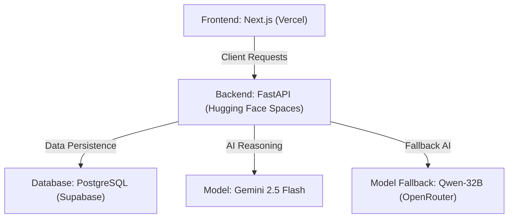

# StyleSense — Multi-Platform Production Deployment Guide 🚀

This guide provides step-by-step instructions for deploying the **StyleSense FastAPI Backend to Hugging Face Spaces (Docker)** and the **Next.js Frontend to Vercel**, connected to a cloud **Supabase Database**.

---

## 📦 Deployment Architecture



---

## 🛠️ Step 1: Deploy Backend to Hugging Face Spaces

Hugging Face Spaces supports running custom Dockerfiles with full container control and easy GPU scaling.

### 1. Create a New Space
1. Log in to your account at [huggingface.co](https://huggingface.co).
2. Click **New Space** or go to `huggingface.co/new-space`.
3. Fill out the details:
   * **Space Name**: `stylesense-backend` (or a name of your choice).
   * **SDK**: Select **Docker**.
   * **Template**: Select **Blank** (do not select Gradio/Streamlit).
   * **Space Hardware**: Select **CPU Basic (Free)**. You can upgrade to a **T4 GPU** or **A10G GPU** later for faster CLIP calculations.
   * **Visibility**: Public (so the Vercel frontend can make API requests to it).

### 2. Configure Environment Variables (Secrets)
1. In your Hugging Face Space, navigate to the **Settings** tab.
2. Scroll down to **Variables and secrets**.
3. Under **Secrets**, click **New secret** and add the following:
   * `SUPABASE_URL`: Your Supabase Project URL (e.g. `https://xxx.supabase.co`).
   * `SUPABASE_ANON_KEY`: Your Supabase anonymous API key.
   * `SUPABASE_SERVICE_ROLE_KEY`: Your Supabase service role key (required for administrative operations).
   * `GEMINI_API_KEY`: Your Google GenAI API key.
   * `OPENROUTER_API_KEY`: Your OpenRouter API key (fallback provider).
   * `SUPABASE_STORAGE_BUCKET`: `product-images`
   * `ADMIN_PASSWORD`: Your custom admin portal password (e.g., `abrar14`).

### 3. Push Backend Code
You can push the `backend` folder to the Hugging Face Space repository.
1. Hugging Face Spaces are backed by standard Git repositories. Clone the space locally using the URL provided in the space setup:
   ```bash
   git clone https://huggingface.co/spaces/YOUR_USERNAME/YOUR_SPACE_NAME
   ```
2. Copy all files from the `f:\stylelence\backend` folder into the cloned directory.
3. Commit and push the files:
   ```bash
   git add .
   git commit -m "Deploy FastAPI StyleSense backend"
   git push
   ```
4. Hugging Face will automatically detect the `Dockerfile`, build your container (pre-downloading the CLIP models), and host your API securely! Your API base URL will be:
   `https://YOUR_HF_USERNAME-YOUR_SPACE_NAME.hf.space`

---

## ⚡ Step 2: Deploy Frontend to Vercel

Vercel is the premier platform for Next.js web applications, offering high performance edge proxying.

### 1. Initialize Git & Push to GitHub
1. Create a new repository on your GitHub account (e.g., `stylesense-frontend`).
2. Push your `f:\stylelence\frontend` directory to the repository:
   ```bash
   cd f:\stylelence\frontend
   git init
   git remote add origin YOUR_GITHUB_REPO_URL
   git branch -M main
   git add .
   git commit -m "StyleSense frontend initial commit"
   git push -u origin main
   ```

### 2. Connect Repository in Vercel
1. Log in to [vercel.com](https://vercel.com).
2. Click **Add New** $\rightarrow$ **Project**.
3. Import your GitHub repository (`stylesense-frontend`).
4. In the **Configure Project** step:
   * **Framework Preset**: Select **Next.js**.
   * **Root Directory**: Select `./` (or `frontend` if deploying a monorepo).

### 3. Configure Environment Variables
Expand the **Environment Variables** section on Vercel and add the following keys:
* `NEXT_PUBLIC_API_URL`: Your Hugging Face Space URL (e.g., `https://YOUR_HF_USERNAME-YOUR_SPACE_NAME.hf.space`).
  * *Note: Do not include a trailing slash.*
* `NEXT_PUBLIC_SUPABASE_URL`: Your Supabase Project URL.
* `NEXT_PUBLIC_SUPABASE_ANON_KEY`: Your Supabase anonymous API key.
* `NEXT_PUBLIC_STORAGE_BUCKET`: `product-images`

### 4. Deploy!
Click **Deploy**. Vercel will build the Next.js production package and deploy it to a gorgeous, secure domain (e.g., `https://stylesense.vercel.app`) in under 2 minutes!

---

## 🔒 Step 3: CORS & Security Configuration

* **No CORS Issues**: Next.js uses standard proxy rewrites internally (configured in `next.config.ts`). When the browser makes a request to `/api/chat` on the Vercel domain, Vercel's server proxies it to the `NEXT_PUBLIC_API_URL` (Hugging Face Space) in the background. This completely bypasses all cross-origin restrictions in the browser!
* **Secure Admin Operations**: The backend uses the `X-Admin-Password` header verification for all catalog changes and order updates, keeping the admin endpoints fully secure.
